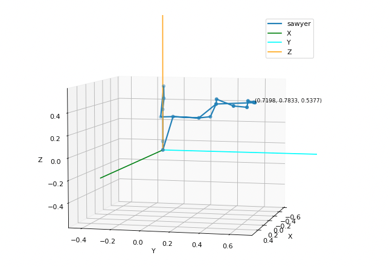
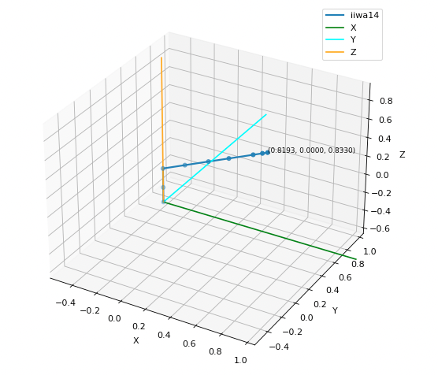

# pykin

  

Python Interface for the Robot Kinematics Library [pykin](https://jdj2261.github.io/pykin/)

This library has been created simply by referring to [ikpy](https://github.com/Phylliade/ikpy.git)

## Features

- Pure python library
- Support only URDF file
- Compute Forward, Inverse Kinematics and Jacobian, referred to the [Introduction to Humanoid Robotics book](https://link.springer.com/book/10.1007/978-3-642-54536-8).
- Check self-collision and collision between objects
- Path Planning (Caretsian Planning)
- Motion Planning (RRT-star)
- Plot Robot Kinematic Chain and Mesh
- Compute and Visualize grasp pose

## Installation

### Requirements

You need a [python-fcl](https://github.com/BerkeleyAutomation/python-fcl) package to do object collision checking.

- For Ubuntu, using  `apt`

  `sudo apt install liboctomap-dev`

  `sudo apt install libfcl-dev`
- For Mac, First, Download the source and build it.

  - octomap

    `git clone https://github.com/OctoMap/octomap.git`

    ~~~
    $ cd octomap
    $ mkdir build
    $ cd build
    $ cmake ..
    $ make
    $ make install
    ~~~
  - fcl

    `git clone https://github.com/flexible-collision-library/fcl.git`

    Since python-fcl uses version 0.5.0 of fcl, checkout with tag 0.5.0

    ~~~
    $ cd fcl
    $ git checkout 0.5.0
    $ mkdir build
    $ cd build
    $ cmake ..
    $ make
    $ make install
    ~~~

If the above installation is complete

~~~
pip install python-fcl
~~~

### Install Pykin

~~~
pip install pykin
~~~

When clone a repository, use the **--recurse-submodules** option.
The download may take a long time due to the large urdf file size.

~~~
git clone --recurse-submodules https://github.com/jdj2261/pykin.git
~~~

If you hadn't done this

~~~
$ git clone https://github.com/jdj2261/pykin.git
$ git submodule init
$ git submodule update
~~~

## Quick Start

- Robot Info

  You can see 4 example robot information.

  `baxter, iiwa14, panda, and sawyer`

  

    
Code

  ~~~python
  import sys
  
  file_path = '../asset/urdf/baxter/baxter.urdf'
  
  if len(sys.argv) > 1:
      robot_name = sys.argv[1]
      file_path = '../asset/urdf/' + robot_name + '/' + robot_name + '.urdf'
  
  if "baxter" in file_path:
      from pykin.robots.bimanual import Bimanual
      robot = Bimanual(file_path)
  else:
      from pykin.robots.single_arm import SingleArm
      robot = SingleArm(file_path)
  
  robot.show_robot_info()
  ~~~
  
  

  
- Forward Kinematics

  

    
Code

  ~~~python
  import numpy as np
  
  from pykin.robots.bimanual import Bimanual
  from pykin.kinematics.transform import Transform
  from pykin.utils import plot_utils as plt
  from pykin.utils.kin_utils import ShellColors as sc
  
  # baxter_example
  file_path = '../../asset/urdf/baxter/baxter.urdf'
  robot = Bimanual(file_path, Transform(rot=[0.0, 0.0, 0.0], pos=[0, 0, 0]))
  
  head_thetas = [0.0]
  right_arm_thetas = [np.pi/3, -np.pi/5, -np.pi/2, np.pi/7, 0, np.pi/7 ,0]
  left_arm_thetas = [0, 0, 0, 0, 0, 0, 0]
  
  thetas = head_thetas + right_arm_thetas + left_arm_thetas
  fk = robot.forward_kin(thetas)
  
  for link, transform in fk.items():
      print(f"{sc.HEADER}{link}{sc.ENDC}, {transform.rot}, {transform.pos}")
  ~~~
  
  

  
- Jacobian

  

    
Code

  ~~~python
  import numpy as np
  
  from pykin.kinematics import transform as tf
  from pykin.robots.bimanual import Bimanual
  from pykin.kinematics import jacobian as jac
  
  file_path = '../asset/urdf/baxter/baxter.urdf'
  robot = Bimanual(file_path, tf.Transform(rot=[0.0, 0.0, 0.0], pos=[0, 0, 0]))
  
  left_arm_thetas = np.zeros(15)
  robot.setup_link_name("base", "right_wrist")
  robot.setup_link_name("base", "left_wrist")
  
  fk = robot.forward_kin(left_arm_thetas)
  
  J = {}
  for arm in robot.arm_type:
      if robot.eef_name[arm]:
          J[arm] = jac.calc_jacobian(robot.desired_frames[arm], fk, len(np.zeros(7)))
  
  print(J)
  ~~~
  
  

  
- Inverse Kinematics

  

    
Code

  ~~~python
  import numpy as np
  
  from pykin.robots.bimanual import Bimanual
  from pykin.kinematics.transform import Transform
  from pykin.utils import plot_utils as plt
  
  file_path = '../../asset/urdf/baxter/baxter.urdf'
  
  robot = Bimanual(file_path, Transform(rot=[0.0, 0.0, 0.0], pos=[0, 0, 0]))
  
  visible_collision = True
  visible_visual = False
  
  # set target joints angle
  head_thetas =  np.zeros(1)
  right_arm_thetas = np.array([-np.pi/4 , 0, 0, 0, 0 , 0 ,0])
  left_arm_thetas = np.array([np.pi/4 , 0, 0, 0, 0 , 0 ,0])
  
  thetas = np.concatenate((head_thetas ,right_arm_thetas ,left_arm_thetas))
  
  robot.setup_link_name("base", "right_wrist")
  robot.setup_link_name("base", "left_wrist")
  
  #################################################################################
  #                                Set target pose                                #
  #################################################################################
  target_transformations = robot.forward_kin(thetas)
  _, ax = plt.init_3d_figure("Target Pose")
  plt.plot_robot(robot, 
                 ax=ax,
                 transformations=target_transformations,
                 visible_visual=visible_visual, 
                 visible_collision=visible_collision,
                 mesh_path='../../asset/urdf/baxter/')
  
  #################################################################################
  #                                Inverse Kinematics                             #
  #################################################################################
  init_thetas = np.random.randn(7)
  target_pose = { "right": robot.get_eef_pose(target_transformations)["right"], 
                  "left" : robot.get_eef_pose(target_transformations)["left"]}
  
  ik_LM_result = robot.inverse_kin(
      init_thetas, 
      target_pose, 
      method="LM", 
      maxIter=100)
  
  ik_NR_result = robot.inverse_kin(
      init_thetas, 
      target_pose, 
      method="NR", 
      maxIter=100)
  
  print(ik_LM_result, ik_NR_result)
  ~~~
  
  

  
- Check Collision

  *The image below shows the result of a sawyer head and milk collision.*

  |  |  |
  | ------------------------------------------------------------ | ------------------------------------------------------------ |

## Visualization

- urdf

  *You can see visualization using matplotlib.*

|          baxter          |          sawyer          |          iiwa14          |          panda          |
| :-------------------------: | :-------------------------: | :-------------------------: | :-----------------------: |
|  |  |  |  |

- collision

  *You can see collision defined in collision/geometry tags in urdf.*

|               baxter               |               sawyer               |
| :-----------------------------------: | :-----------------------------------: |
|  |  |

- mesh

  *You can see  mesh defined in visual/geometry tags in urdf.*
  
  

- Planning

  *You can see an planning animation that visualizes trajectory*

  - Cartesian planning

    |                            iiwa14                            |                            panda                             |                            sawyer                            |
    | :----------------------------------------------------------: | :----------------------------------------------------------: | :----------------------------------------------------------: |
    |  |  |  |

  - RRT-star planning

    |                         iiwa14                          |                          panda                           |                          sawyer                           |
    | :-----------------------------------------------------: | :------------------------------------------------------: | :-------------------------------------------------------: |
    |  |  |  |

